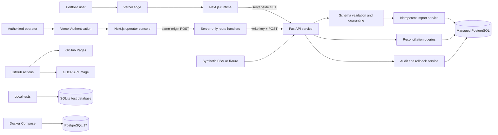
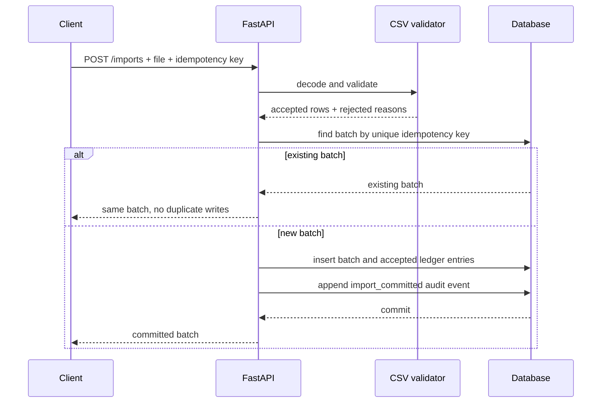
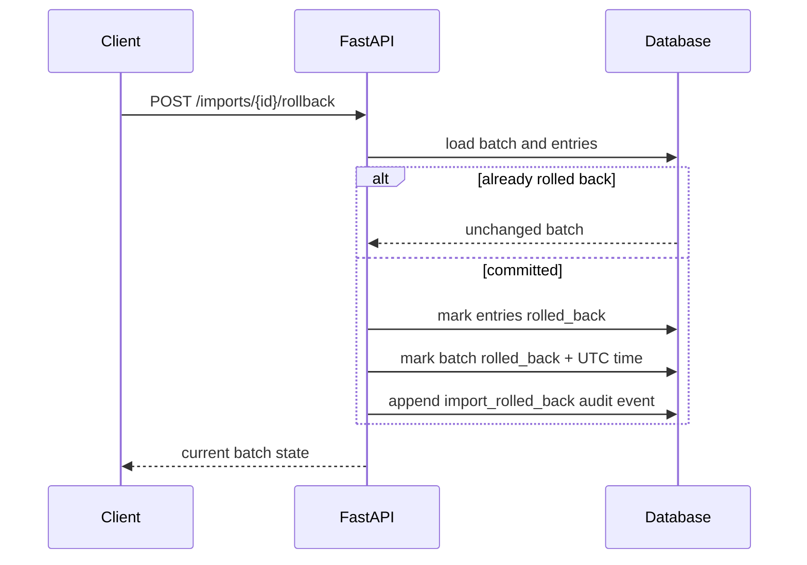

# LedgerFlow — Project Defense Preparation

## Evidence links

- Live full-stack UI: https://ledgerflow-web-steel.vercel.app/
- Protected operator workspace: https://ledgerflow-operator.vercel.app/ (Vercel account access required)
- Live API health: https://ledgerflow-api-nine.vercel.app/health
- Static fallback UI: https://abdul-rahman96.github.io/ledgerflow/
- Source: https://github.com/abdul-rahman96/ledgerflow
- Release: https://github.com/abdul-rahman96/ledgerflow/releases/tag/v0.1.1
- CI/CD: https://github.com/abdul-rahman96/ledgerflow/actions
- API image: `ghcr.io/abdul-rahman96/ledgerflow-api:0.1.1`
- Walkthrough: attached to the v0.1.1 GitHub Release

## 30-second answer

LedgerFlow is a clean-room financial-data operations control plane. It accepts a strict CSV contract, quarantines invalid or duplicate rows, commits valid records idempotently, exposes reconciliation variances, and rolls a batch back through compensating state changes while preserving its audit history. I built a public Next.js and TypeScript portfolio interface, a separate authenticated Next.js operator console, a FastAPI and SQLAlchemy API, PostgreSQL persistence, Docker Compose, and GitHub Actions that test, scan, build, and deploy the static fallback. The operator app is protected by Vercel Authentication and calls the API through same-origin server routes that add a rotated server-only write key. Everything is synthetic, open source, and separated from employer or client code.

## Two-minute explanation

The project addresses a common operational problem: transaction data often arrives from files or external systems with inconsistent formatting, duplicate delivery, partial errors, and a need for traceability. A naive importer can duplicate money, lose rejected rows, or delete evidence during rollback.

LedgerFlow treats an import as a first-class batch. A CSV is decoded and validated against a required schema. Valid rows become normalized ledger entries; invalid rows are quarantined with row-level reasons. An idempotency key uniquely identifies the import request, so retrying the same request returns the existing batch instead of writing duplicates. Each commit or rollback writes an append-only audit event. Rollback changes the batch and its entries to `rolled_back` rather than deleting them, preserving provenance.

The primary portfolio deployment is a public, read-only Vercel application. A separate `ledgerflow-operator` deployment supplies the real write workflow without expanding the public attack surface. Vercel Authentication gates every operator URL. The authenticated browser sends only same-origin requests; Next.js route handlers validate origin and inputs, then inject the write key server-side when calling FastAPI. FastAPI persists synthetic data in managed PostgreSQL and independently checks the credential and CSV contract. GitHub Pages remains a deterministic static fallback, and Docker Compose remains the reproducible local full-stack path.

## Scope and clean-room boundary

LedgerFlow is an original portfolio implementation, not a copy, fork, or modernization of an employer/client system. No private schemas, proprietary algorithms, production data, names, endpoints, code, or credentials were reused. All records are synthetic. Old connector keys were excluded rather than tested because “expired” credentials should still be treated as secrets and can be reactivated, logged, or mishandled.

The repository is safe to keep public because:

- no external connector keys are required;
- fixture and CSV connectors are deterministic;
- Compose credentials are explicit local-only placeholders;
- production secrets live only in Vercel and managed database settings;
- the public browser receives no mutation or database credential;
- Gitleaks scans the full Git history in CI;
- releases use the repository-scoped `GITHUB_TOKEN`, not a copied personal token;
- the publication audit found no secret patterns or unrelated company/project identifiers.

## User-facing capabilities

1. **Overview:** shows cash movement, control health, queue priority, and recent import batches.
2. **Ledger:** shows normalized entries with source provenance, fixed-precision amounts, statuses, and UTC timestamps.
3. **Import and validate:** previews accepted and rejected rows before an idempotent commit.
4. **Reconciliation:** compares source and ledger amounts and orders variances by absolute material impact.
5. **Audit and rollback:** displays append-only events and supports reversible batch state.

## High-level system design



### Deployment topology

- Vercel hosts three isolated projects from one monorepo: the public Next.js web runtime, the protected Next.js operator runtime, and the FastAPI service.
- The web runtime calls the API only from the server. Public visitors can inspect live synthetic read models but cannot invoke write operations through the UI.
- The operator project uses Vercel Authentication on every deployment. Its browser never sees `WRITE_API_KEY`; same-origin route handlers add it only on the server.
- The API uses a free-tier managed PostgreSQL database. It fails production startup if storage is SQLite, CORS is wildcarded, or the write key is weak or absent.
- Operator preview and production deployments use Vercel Authentication. All deployments benefit from Vercel system DDoS mitigations and restrictive response headers.
- GitHub Pages hosts the exported Next.js interface under the `/ledgerflow` base path as a fixture-backed fallback.
- CI is the release gate. Pages deployment waits for secret scanning, API quality, web quality, and both container builds; tagged releases publish the API image to GHCR.

## Low-level design

### Data model

| Entity | Important fields | Design purpose |
| --- | --- | --- |
| `ImportBatch` | ID, file name, unique idempotency key, status, accepted/rejected counts, timestamps | Makes delivery, retry, and rollback state explicit |
| `LedgerEntry` | External ID, event time, description, `Numeric(20,4)` amount, currency, account, source, status, batch FK | Normalized financial record with provenance |
| `ReconciliationItem` | Entry FK, source amount, variance, review status | Separates matching evidence from ledger truth |
| `AuditEvent` | Action, entity type/ID, actor, JSON metadata, UTC time | Append-only operational evidence |

IDs use readable prefixes plus random UUID material, such as `imp_...`, `txn_...`, and `evt_...`. Foreign keys preserve the lineage from every ledger entry back to its source batch.

### API surface

| Method and path | Responsibility |
| --- | --- |
| `GET /health` | Service and connector-mode health |
| `GET /api/v1/dashboard` | Aggregate inflow, outflow, net, and review count |
| `GET /api/v1/entries` | Time-ordered ledger |
| `POST /api/v1/imports/preview` | Validate without persistence |
| `POST /api/v1/imports` | Idempotently commit accepted rows and an audit event |
| `GET /api/v1/imports` | List batches |
| `POST /api/v1/imports/{batch_id}/rollback` | Apply a compensating state transition |
| `GET /api/v1/reconciliations` | Return source-versus-ledger variance ordered by absolute value |
| `GET /api/v1/audit-events` | Return newest audit events first |

### CSV contract

```text
external_id,occurred_at,description,amount,currency,account
```

Validation requires every column, UTF-8 input, a non-empty external ID, a parseable ISO timestamp, a decimal amount, a three-letter currency code, and no repeated external ID inside one file. A row-level problem quarantines that row instead of rejecting all valid rows. A missing required column rejects the request because the file contract itself is invalid.

### Import sequence



### Rollback sequence



## Why each technology was used

### Next.js 16 and TypeScript

Next.js provides file-based routing, consistent layouts, metadata, and a production build pipeline. The runtime build lets the live UI fetch API data on the server without exposing infrastructure secrets. A separate static export keeps the project hostable on GitHub Pages as a deterministic fallback. TypeScript catches UI data-shape and component errors before deployment.

**Tradeoff:** a third deployment adds configuration and release surface, but it keeps dynamic mutation code out of the static-exportable public app. The result is a public review surface plus an owner-only operational surface with independent access policy.

### Why a monorepo

The repository is a monorepo because the public web app, protected operator app, and API implement one product contract and should evolve under one review and CI boundary. Each app has its own dependencies, runtime, Vercel project, and environment variables, so deployment isolation is retained. Shared history makes API/UI changes auditable together, while path-specific builds keep the services independently deployable. This is intentionally a small multi-app repository, not a complex microservice platform.

### Tailwind CSS, shadcn patterns, and Radix primitives

These provide a small, composable design system, accessible primitives, and predictable visual consistency without a proprietary UI license. Components remain in the repository and can be adapted rather than hidden behind a vendor abstraction.

### FastAPI and Pydantic

FastAPI makes request validation, typed dependency injection, file uploads, and OpenAPI documentation concise. Pydantic settings support environment-driven configuration, a keyless local default, and fail-closed production validation. Production disables the documentation and OpenAPI routes to reduce unnecessary public surface area.

### SQLAlchemy 2

SQLAlchemy keeps persistence explicit and portable across SQLite tests and PostgreSQL runtime deployment. Typed mapped models make database semantics visible in Python and reduce stringly typed query code.

### PostgreSQL 17

PostgreSQL is appropriate for transactional financial operations, unique idempotency constraints, exact numerics, foreign keys, and auditable queries. The live deployment uses managed PostgreSQL; Docker Compose runs PostgreSQL 17 locally.

### Decimal and `Numeric(20,4)`

Binary floating point can introduce rounding surprises in monetary comparisons. Decimal parsing and fixed-precision database numerics keep representation and variance calculations deterministic. A production system would also define currency-specific scale and rounding policies.

### UTC timestamps

UTC removes server-local timezone ambiguity and supports consistent ordering. Presentation layers can localize times later.

### Docker Compose

Compose gives reviewers one command for the real three-service topology: web, API, and PostgreSQL. Health checks enforce startup order. It avoids requiring any cloud account or key.

### GitHub Actions, Pages, and GHCR

Actions provide reproducible checks on every push. Pages is free for the static public demo. GHCR distributes the backend image. The tagged image includes OCI metadata, SBOM, and provenance attestations to improve supply-chain transparency.

## Testing without connector keys

Keys are unnecessary for the demonstrated contract:

- `FixtureConnector` produces deterministic synthetic CSV bytes.
- `CsvConnector` tests the same parsing and validation boundary an external connector would feed.
- API tests run in-process through FastAPI’s test client with a local database.
- Docker Compose tests the realistic PostgreSQL topology.
- the static UI uses deterministic fixtures, so visual and route checks are stable;
- the live UI exercises server-side reads from FastAPI and managed PostgreSQL;
- browser verification checks both the public read-only experience and the operator form, accessibility tree, error overlay, and fail-closed states;
- operator unit tests cover same-origin enforcement, CSV type/empty/size validation, and idempotency-key bounds;
- an authenticated production smoke test previews a synthetic CSV, commits one three-row batch, and immediately rolls it back.

The automated tests prove health and seeded data, valid fixture parsing, duplicate quarantine, import idempotency, reversible rollback, operator request-origin checks, and browser-side input guardrails. CI additionally proves Ruff linting, pytest, both Next.js lint/type/build paths, operator tests, static export, secret scanning, and both Docker builds.

Production evidence on 2026-09-29: preview accepted three synthetic rows; commit created batch `imp_01e55a310b94`; rollback returned the same batch as `rolled_back` with a timestamp. A cross-origin operator POST returned 403, a direct API mutation without the credential returned 401, and an anonymous operator request redirected to Vercel sign-in.

For a future real connector, use a port/adapter interface and contract tests with recorded synthetic responses. Put live credentials only in a secret manager, run live tests in a protected environment, and never expose them to pull-request builds.

## Security and failure handling

- External connectors are disabled by default.
- Preview, import, and rollback require `X-LedgerFlow-Write-Key`, compared in constant time.
- The write key and database URL are server-only Vercel environment variables.
- The write key was rotated during operator deployment and configured only on the API and operator projects.
- Vercel Authentication protects every operator preview and production request.
- Operator mutations require same-origin requests and repeat the file-size/type and idempotency validation before forwarding.
- Operator responses use private/no-store caching and no-index headers.
- The API assigns the audit actor server-side instead of trusting caller input.
- CORS origins are explicit and credentials are disabled.
- CSV uploads are limited to one MiB and require an accepted content type and `.csv` filename.
- Production refuses weak/missing write keys, wildcard CORS, and SQLite.
- Production API docs and OpenAPI are disabled.
- Restrictive CSP, HSTS, framing, MIME-sniffing, permissions, and referrer headers are set.
- Vercel Authentication protects the complete operator deployment, and platform DDoS mitigations are active.
- Invalid file contracts return HTTP 422.
- Unknown rollback batches return HTTP 404.
- Duplicate requests converge on one uniquely keyed batch.
- Duplicate rollback requests are harmless because rollback is state-aware.
- Rollback preserves history instead of issuing destructive deletes.
- Gitleaks scans full history before Pages deployment.
- Container releases use least-privilege workflow permissions: contents read and packages write.

## Scalability and production evolution

The current synchronous import is intentionally small. At higher volume:

1. stream the upload to object storage instead of keeping it in request memory;
2. enqueue batch work through a durable queue;
3. parse in chunks and use bulk inserts;
4. persist rejected-row details and immutable input checksums;
5. add database migrations rather than startup `create_all`;
6. use a database-backed idempotency record with request hash and response snapshot;
7. partition or index ledger data by tenant and occurrence time;
8. calculate reconciliation incrementally and expose pagination;
9. add OpenTelemetry traces, structured logs, metrics, and alerting;
10. add authentication, authorization, tenant isolation, retention, and encryption policies.

## Honest limitations

- The public live UI is read-only; the write workflow exists only in the separately authenticated operator app.
- Vercel Authentication establishes owner/team access at the edge, while API mutation authorization is still one service credential rather than application-level roles or multi-tenancy.
- Two Vercel firewall rules are staged in log-only mode for observation and still require account-owner review and publication.
- A custom Cloudflare domain, Access policy, and Cloudflare WAF are not configured; Wrangler is installed locally but not authenticated.
- Reconciliation data is seeded; there is no configurable matching-rule engine yet.
- Row rejection details are returned during preview but are not persisted as their own table.
- Schema creation uses `create_all`; a production system needs versioned migrations.
- Imports are synchronous and load the uploaded CSV in memory.
- Database-level protection prevents duplicate idempotency keys, but race handling should catch and resolve a concurrent unique-constraint conflict explicitly.
- External IDs are only checked for duplicates within the uploaded file, not globally across all batches.

These are deliberate MVP boundaries, not hidden production claims.

## Likely defense questions

### Why is the public repository safe?

It contains only original code and synthetic records. No external keys are required, connector credentials are excluded, full Git history is secret-scanned, and old keys are treated as sensitive even if believed expired.

### Why not make the repository private?

The goal is verifiable portfolio evidence. A public repository is appropriate after a clean-room and secret audit. A private repository would reduce reviewer access without materially improving safety for this keyless synthetic project.

### How can the deployed app be used if the public page is read-only?

The public URL is intentionally a reviewer-facing read model. The owner signs into the separate operator URL with the Vercel account, selects a synthetic CSV, previews accepted and rejected rows, reviews the idempotency key, commits, and can then perform a two-step compensating rollback. The write key stays in the operator server runtime and is never entered into or returned to the browser.

### Why is the operator a separate app?

The public app must also support a deterministic static export for GitHub Pages. Server route handlers and protected mutations do not belong in that artifact. A separate operator app preserves static portability, narrows the protected surface, isolates credentials, and lets Vercel Authentication cover every operator request without hiding the public portfolio.

### How does idempotency work?

The client supplies a key. The service queries `ImportBatch.idempotency_key`, which also has a unique database constraint. If the batch exists, the service returns it and writes nothing. A stronger production version would bind the key to a request-body hash and handle concurrent insert conflicts.

### Why not delete data during rollback?

Deletion destroys provenance and complicates incident review. LedgerFlow uses a compensating state change: the batch and its entries become `rolled_back`, a timestamp is recorded, and an audit event explains the action.

### Why use both SQLite and PostgreSQL?

SQLite gives a zero-service, keyless test path. PostgreSQL is the intended runtime database and is exercised through Compose and container builds. SQLAlchemy keeps the persistence layer portable while the model uses relational constraints that map naturally to PostgreSQL.

### Is reconciliation implemented or only displayed?

The backend models reconciliation items and queries them by absolute variance; the UI demonstrates the operating view with synthetic data. Automated matching rules and ingestion-generated reconciliation records are future work.

### What was the hardest engineering issue?

The core challenge was designing safety properties across boundaries: deterministic money, idempotent delivery, row-level quarantine, reversible operations, and an audit trail. Publication also required a clean-room boundary, a secret-free demo path, and CI that prevents deploying if any quality gate fails.

### What would you build next?

First, replace the owner-only operator model with application-level identity and role-based authorization if multiple operators or tenants are introduced. Then add migrations, persisted rejection records, request-hash idempotency, a queue-backed import worker, configurable matching rules, pagination, and observability.

## Three-minute demo talk track

**0:00–0:25 — Context.** “LedgerFlow is a clean-room financial-data operations control plane. It focuses on safely importing, validating, reconciling, and reversing transaction batches without losing evidence.”

**0:25–0:50 — Overview.** “The overview summarizes cash movement, control health, and the highest-priority reconciliation variances. All records are synthetic, so the public demo needs no customer data or credentials.”

**0:50–1:15 — Ledger.** “The ledger normalizes each entry into a stable schema with provenance, exact decimal money, currency, account, state, and UTC time. Every entry links back to its source batch.”

**1:15–1:45 — Import.** “I switch to the Vercel-authenticated operator workspace. The browser sends the CSV to a same-origin server route; the secret never enters client code. Preview separates accepted rows from quarantined rows. Commit requires an idempotency key, so retrying returns the same batch instead of duplicating money.”

**1:45–2:10 — Reconciliation.** “Reconciliation compares source and ledger values and orders differences by absolute impact, which helps operators focus on material exceptions. The current MVP seeds this evidence; a future matching engine would generate it from configurable rules.”

**2:10–2:35 — Audit and rollback.** “Rollback is non-destructive. It marks the batch and its entries as rolled back and appends an audit event with the actor and affected count. Repeating rollback is harmless.”

**2:35–3:00 — Engineering and delivery.** “The monorepo contains independent public web, protected operator, and API apps. GitHub Actions scans secrets, tests all three surfaces, builds both containers, gates the Pages fallback, and publishes an API image with an SBOM and provenance. The public UI stays readable; the operator requires Vercel identity plus a server-only API credential.”

## Final claim checklist

- Say **“public live read-only UI plus a Vercel-authenticated owner operator backed by FastAPI and managed PostgreSQL”**, not “multi-user authenticated SaaS.”
- Say **“idempotent by client key and database uniqueness”**, while acknowledging concurrent-conflict hardening as future work.
- Say **“append-only audit events in the service behavior”**, not “tamper-proof compliance ledger.”
- Say **“reconciliation model and variance query”**, not “complete rules engine.”
- Say **“clean-room portfolio reconstruction with synthetic data”** and never imply employer/client code was published.
