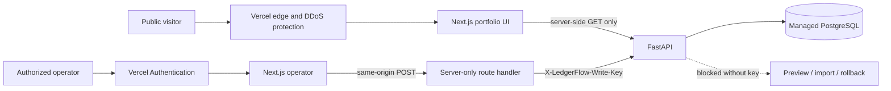

# Deployment security

LedgerFlow uses a split public/read and private/write model. The portfolio UI and synthetic read endpoints are public so reviewers can inspect the system. Preview, import, and rollback are operator operations and require a high-entropy secret that is stored only in the API host.

Current production endpoints:

- Web: https://ledgerflow-web-steel.vercel.app/
- API health: https://ledgerflow-api-nine.vercel.app/health
- Operator: https://ledgerflow-operator.vercel.app/ (Vercel Authentication required)

## Trust boundaries

- The browser never receives `WRITE_API_KEY` or database credentials.
- Every production and preview request to the operator project passes Vercel Authentication before reaching Next.js.
- Operator POST handlers require an exact same-origin `Origin`, revalidate CSV type/size and idempotency input, and fail closed when server configuration is absent.
- Next.js fetches live read models on the server. GitHub Pages continues to use deterministic fixtures.
- FastAPI checks mutation keys with constant-time comparison and assigns the audit actor server-side.
- Production startup fails if the write key is shorter than 32 characters, CORS is wildcarded, or the database is SQLite.
- CSV uploads require an accepted MIME type and `.csv` extension, are read only to a one-megabyte ceiling, and reject empty bodies.
- Production API docs and the OpenAPI document are disabled.
- API and web responses include restrictive framing, content-type, referrer, permissions, HSTS, and content-security headers.

## Required Vercel settings

Create separate Vercel projects rooted at `apps/api`, `apps/web`, and `apps/operator`.

API environment:

| Variable | Scope | Purpose |
| --- | --- | --- |
| `ENVIRONMENT=production` | Preview and production | Enables fail-closed checks and hides API docs |
| `DATABASE_URL` | Preview and production | Managed PostgreSQL connection; never SQLite |
| `WRITE_API_KEY` | Preview and production, sensitive | At least 32 random characters; mutation authorization |
| `CORS_ORIGINS` | Preview and production | Exact web origins, comma separated; never `*` |
| `CONNECTOR_MODE=fixture` | Preview and production | Prevents unreviewed external connectors |
| `MAX_UPLOAD_BYTES=1048576` | Preview and production | Application-level upload ceiling |

Web environment:

| Variable | Scope | Purpose |
| --- | --- | --- |
| `LEDGERFLOW_API_URL` | Preview and production | Server-only API origin; do not prefix with `NEXT_PUBLIC_` |

Operator environment:

| Variable | Scope | Purpose |
| --- | --- | --- |
| `LEDGERFLOW_API_URL` | Preview and production | Server-only API origin |
| `WRITE_API_KEY` | Preview and production, sensitive | Same rotated high-entropy value configured on the API |

Set `ssoProtection.deploymentType` to `all` on the operator project. The public web project remains accessible to reviewers and contains no mutation proxy.

Use a Vercel Marketplace PostgreSQL resource with a free plan when available. Review the provider plan before provisioning. The database URL and write key must be marked sensitive and must never be copied into GitHub Actions logs or repository files.

## Edge controls

Vercel system DDoS mitigations remain enabled. The operator project uses Vercel Authentication for all deployments, including production. The portfolio UI and read API remain public; mutation routes require both the edge identity gate and the API write credential.

After the API project exists:

1. Add a firewall rule matching `POST /api/v1/imports*` with a generous rate threshold and action `log`.
2. Add a log-only rule for common exploit-probe paths.
3. Review traffic and false positives.
4. Inspect the staged diff and preview enforcement.
5. The account owner publishes the firewall configuration only after review.

Do not begin with a broad deny rule. Attack Mode is an incident control, not a permanent substitute for endpoint authorization.

The two rules are currently staged in log-only mode and are not published. The account owner must inspect the Vercel firewall diff and publish them explicitly. They do not block traffic until publication, and log mode should be observed before any enforcement action is considered.

## Optional Cloudflare layer

Wrangler is installed locally, but no Cloudflare account is authenticated and no Cloudflare-managed custom hostname has been selected. The current `vercel.app` deployment should not be proxied through an improvised second routing layer. If a custom portfolio domain is added later, Cloudflare Access can gate an operator surface and Cloudflare WAF/rate controls can protect that hostname while Vercel remains the origin. Store Cloudflare credentials outside the repository and grant only the minimum zone/account permissions needed.

## Verification

The release gate must prove:

- unauthenticated mutations return `401`;
- missing production secrets or durable storage fail startup;
- over-limit uploads return `413`;
- static Pages and dynamic Vercel builds both compile;
- API lint/tests, web lint/type checks, secret scanning, and container builds pass;
- the preview deployment is checked before production promotion;
- production GETs succeed while an unauthenticated POST stays blocked;
- an anonymous operator request redirects to Vercel sign-in;
- an authenticated synthetic preview succeeds, then commit and rollback converge on `rolled_back`;
- a cross-origin operator POST returns `403` and a direct keyless API POST returns `401`;
- Vercel runtime logs show no new error cluster after promotion.

## Incident response

If abuse is observed, enable Attack Mode for a bounded period, inspect runtime and firewall logs, revoke unexpected Vercel sessions, and rotate `WRITE_API_KEY` in both the API and operator projects before redeploying them. If database credentials may be exposed, rotate them through the provider, update Vercel environment variables, redeploy, and invalidate the old credential. Never pause Vercel system mitigations.
